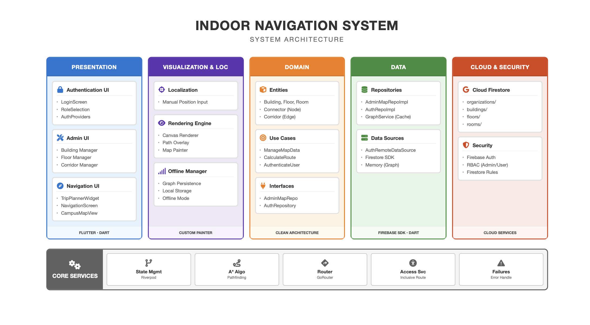
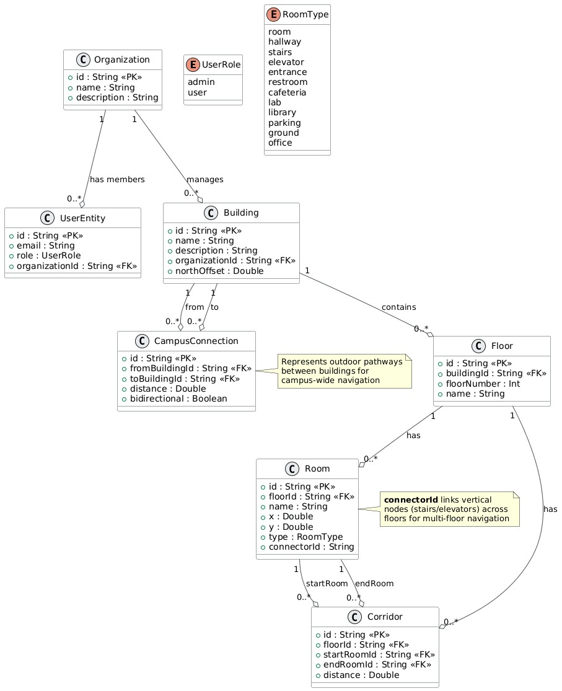
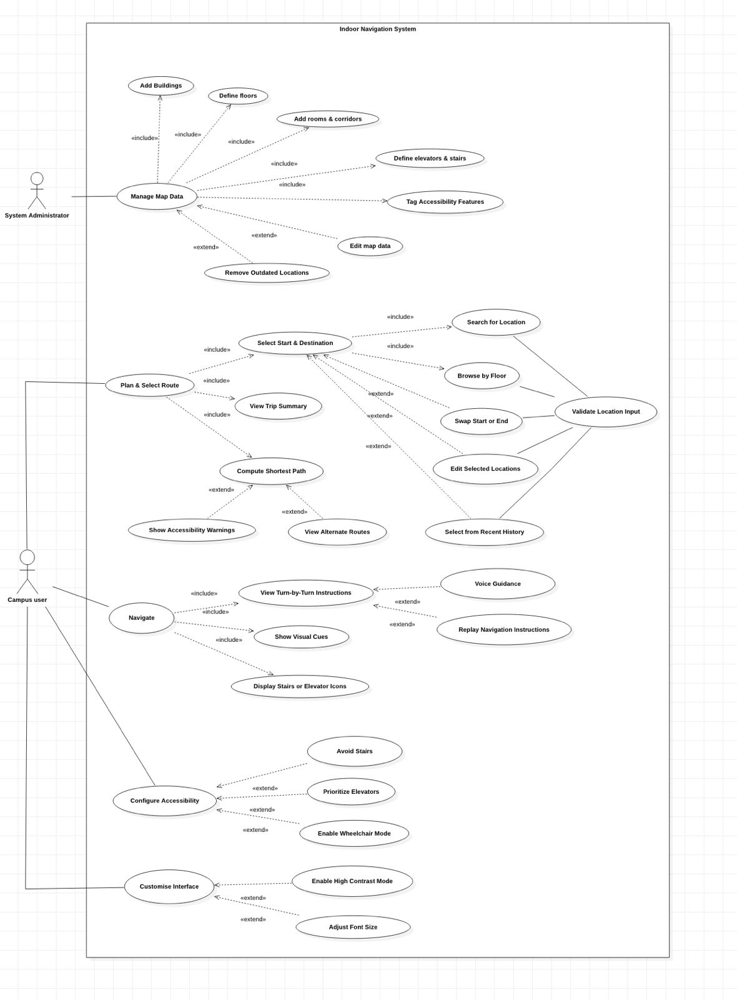
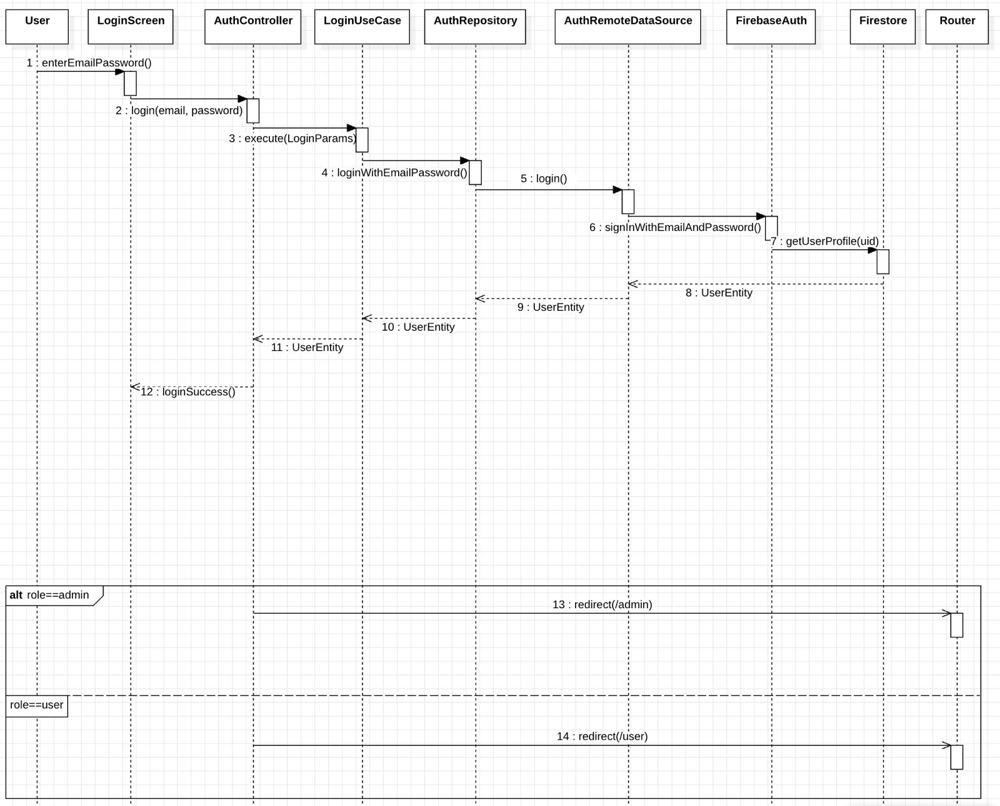
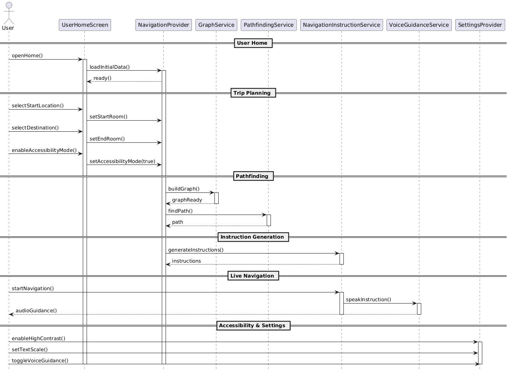
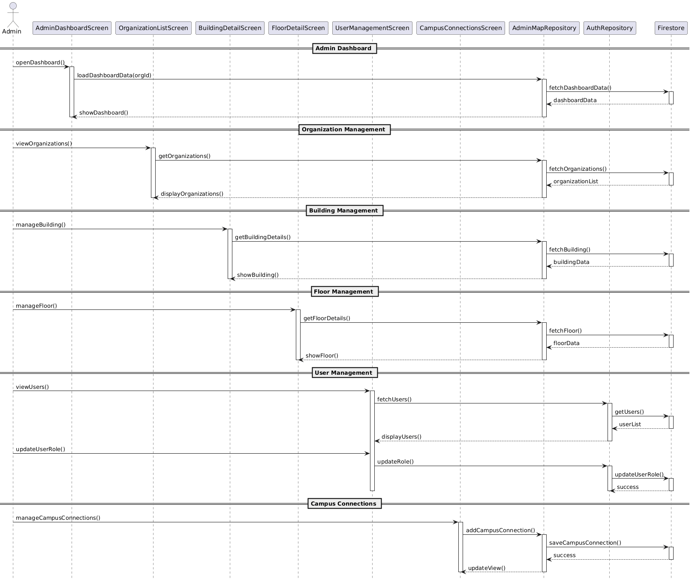

# Indoor Navigation System

<div align="center">


**A mobile application for indoor wayfinding in complex environments using graph-based pathfinding**

[Features](#-features) • [Installation](#-installation) • [Usage](#-usage) • [Architecture](#-architecture) • [Contributing](#-contributing) • [Team](#-team)

</div>

---

## 📖 Table of Contents

- [About](#-about)
- [Features](#-features)
- [Tech Stack](#-tech-stack)
- [Installation](#-installation)
  - [Prerequisites](#prerequisites)
  - [Quick Start](#quick-start)
  - [Firebase Setup](#firebase-setup)
  - [Platform-Specific Instructions](#platform-specific-instructions)
  - [Troubleshooting](#troubleshooting-installation)
- [Usage](#-usage)
  - [Admin Map Management](#admin-map-management)
  - [User Navigation](#user-navigation)
  - [Configuration](#configuration)
- [Architecture](#-architecture)
- [Testing](#-testing)
- [Roadmap](#-roadmap)
- [Contributing](#-contributing)
- [License](#-license)
- [Team](#-team)
- [Acknowledgments](#-acknowledgments)

---

## 🎯 About

The **Indoor Navigation System** is a cross-platform mobile application designed to solve the critical problem of wayfinding in complex indoor environments such as universities, hospitals, shopping malls, and large office buildings. Unlike GPS, which fails indoors due to signal obstruction, this system uses a custom **graph-based pathfinding engine** powered by the **A\* algorithm** to guide users through buildings, across multiple floors, and to specific rooms.

### Why Indoor Navigation?

- **GPS Doesn't Work Indoors**: Satellite signals cannot penetrate buildings effectively
- **Complex Layouts**: Multi-floor buildings with corridors, stairs, and elevators are difficult to navigate
- **Accessibility Needs**: Users with mobility limitations need specialized routing
- **Time-Critical Scenarios**: Hospitals, airports, and universities require efficient wayfinding

### Design Philosophy

Inspired by **Don Norman's "The Design of Everyday Things"**, the UI emphasizes:

- **Affordance**: Clear, intuitive buttons and interactive map elements
- **Feedback**: Instant visual feedback during path calculation and error states
- **Consistency**: Uniform design language across all screens
- **Accessibility**: High-contrast "Deep Void" dark theme with adjustable font sizes

---

## ✨ Features

### 🗺️ Admin Map Management
- **Complete CRUD Operations**: Create, read, update, and delete buildings, floors, rooms, and corridors
- **Firebase Integration**: Real-time data synchronization with Cloud Firestore
- **Hierarchical Organization**: Manage campus infrastructure with building → floor → room hierarchy
- **Connection Management**: Define corridors, stairs, and elevators for navigation graph
- **Accessibility Tagging**: Mark wheelchair-accessible routes and elevators

### 🧭 Intelligent Pathfinding
- **A\* Algorithm**: Optimized shortest-path calculation with heuristic search
- **Multi-Floor Support**: Seamless navigation across floors using stairs and elevators
- **Accessibility Mode**: Avoid stairs and prioritize elevators for users with mobility needs
- **Real-Time Recalculation**: Instant route updates when start/end points change
- **Disconnected Path Detection**: Graceful handling of unreachable destinations
- **Multi-Stop Errand Optimizer**: TSP-based nearest-neighbor routing for efficient multi-waypoint trips
- **Campus Connections**: Cross-building navigation using virtual edges and physical corridors
- **Out-of-Service Handling**: Dynamic exclusion of closed rooms and corridors from route generation

### 👤 User-Friendly Navigation
- **Trip Planner**: Select start and end locations with intuitive search and browse modes
- **Hierarchical Browsing**: Explore locations organized by building and floor
- **Recent Locations**: Quick access to frequently used destinations
- **Swap Functionality**: One-tap reversal of start and end points for return trips
- **Step-by-Step Instructions**: Clear, simple directions with visual cues
- **Visual Navigation**: Icons for stairs, elevators, and directional arrows

### 🔐 Authentication & Security
- **Role-Based Access**: Admin, Student, and Guest user roles
- **Firebase Authentication**: Secure login with email/password
- **Protected Admin Features**: Map management restricted to authorized users
- **Admin Session Safety**: Logout confirmation dialogs to prevent accidental session termination

### 🎨 Modern UI/UX
- **Glassmorphism Design**: Modern aesthetic with purple/pink gradient themes
- **Dark Mode**: High-contrast interface for better visibility
- **Responsive Layout**: Optimized for various screen sizes
- **Google Fonts Integration**: Professional typography with custom fonts

---

## 🛠 Tech Stack

| Category | Technology | Purpose |
|----------|-----------|---------|
| **Frontend** | Flutter (Dart) | Cross-platform mobile UI framework |
| **State Management** | Riverpod | Reactive state management with dependency injection |
| **Backend** | Firebase Firestore | NoSQL cloud database for map data storage |
| **Authentication** | Firebase Auth | Secure user authentication and authorization |
| **Pathfinding** | Custom A\* Algorithm | Local shortest-path calculation on device |
| **Navigation** | GoRouter | Declarative routing for Flutter |
| **Dependency Injection** | GetIt | Service locator pattern |
| **Functional Programming** | fpdart | Either types for error handling |
| **Testing** | flutter_test, mockito, mocktail | Unit and widget testing frameworks |

---

## 📦 Installation

### Prerequisites

Before you begin, ensure you have the following installed:

- **Flutter SDK**: Version 3.9.0 or higher
  ```bash
  flutter --version
  # Flutter 3.9.0 or higher required
  ```
  
- **Dart SDK**: Comes bundled with Flutter (SDK ^3.9.0)

- **IDE**: One of the following:
  - [Visual Studio Code](https://code.visualstudio.com/) with Flutter extension
  - [Android Studio](https://developer.android.com/studio) with Flutter plugin
  - [IntelliJ IDEA](https://www.jetbrains.com/idea/) with Flutter plugin

- **Platform-Specific Requirements**:
  - **Android**: Android Studio, Android SDK (API level 21+)
  - **iOS**: Xcode 14.0+, CocoaPods (macOS only)
  - **macOS**: Xcode Command Line Tools
  - **Windows**: Visual Studio 2022 with C++ development tools
  - **Linux**: Clang, CMake, GTK development headers

- **Firebase Account**: Free tier is sufficient for development

### Quick Start

1. **Clone the Repository**
   ```bash
   git clone https://github.com/KodeWithKeshav/Indoor_Navigation_System_Main.git
   cd Indoor_Navigation_System_Main
   ```

2. **Install Dependencies**
   ```bash
   flutter pub get
   ```

3. **Verify Installation**
   ```bash
   flutter doctor
   ```
   Ensure all checks pass (✓). Address any issues before proceeding.

4. **Run the App**
   ```bash
   # For connected device or emulator
   flutter run
   
   # For specific platform
   flutter run -d chrome        # Web
   flutter run -d macos         # macOS
   flutter run -d windows       # Windows
   flutter run -d linux         # Linux
   ```

### Firebase Setup

The app requires Firebase configuration for authentication and data storage.

#### Step 1: Create Firebase Project

1. Go to [Firebase Console](https://console.firebase.google.com/)
2. Click "Add project" and follow the setup wizard
3. Enable **Google Analytics** (optional)

#### Step 2: Register Your App

**For Android:**
1. Click "Add app" → Select Android
2. Enter package name: `com.example.indoor_navigation_system`
3. Download `google-services.json`
4. Place it in `android/app/` directory

**For iOS:**
1. Click "Add app" → Select iOS
2. Enter bundle ID: `com.example.indoorNavigationSystem`
3. Download `GoogleService-Info.plist`
4. Place it in `ios/Runner/` directory

**For Web/Desktop:**
1. Use FlutterFire CLI (recommended):
   ```bash
   # Install FlutterFire CLI
   dart pub global activate flutterfire_cli
   
   # Configure Firebase
   flutterfire configure
   ```

#### Step 3: Enable Firebase Services

In Firebase Console:
1. **Authentication**: Enable Email/Password sign-in method
2. **Firestore Database**: Create database in production mode
3. **Security Rules**: Update Firestore rules (see below)

**Firestore Security Rules:**
```javascript
rules_version = '2';
service cloud.firestore {
  match /databases/{database}/documents {
    // Allow authenticated users to read all data
    match /{document=**} {
      allow read: if request.auth != null;
    }
    
    // Only admins can write to map data
    match /organizations/{orgId}/{document=**} {
      allow write: if request.auth != null && 
                      get(/databases/$(database)/documents/users/$(request.auth.uid)).data.role == 'admin';
    }
  }
}
```

#### Step 4: Verify Firebase Configuration

Run the app and check for Firebase initialization:
```bash
flutter run
# Look for: "Firebase initialized successfully" in logs
```

### Platform-Specific Instructions

<details>
<summary><b>📱 Android</b></summary>

1. **Minimum SDK**: API level 21 (Android 5.0)
2. **Update `android/app/build.gradle`**:
   ```gradle
   android {
       compileSdkVersion 34
       defaultConfig {
           minSdkVersion 21
           targetSdkVersion 34
       }
   }
   ```
3. **Run on emulator or physical device**:
   ```bash
   flutter run -d <device-id>
   ```

</details>

<details>
<summary><b>🍎 iOS</b></summary>

1. **Minimum iOS**: 12.0
2. **Install CocoaPods dependencies**:
   ```bash
   cd ios
   pod install
   cd ..
   ```
3. **Open in Xcode** (if needed):
   ```bash
   open ios/Runner.xcworkspace
   ```
4. **Run on simulator or device**:
   ```bash
   flutter run -d <device-id>
   ```

</details>

<details>
<summary><b>💻 macOS</b></summary>

1. **Enable macOS desktop**:
   ```bash
   flutter config --enable-macos-desktop
   ```
2. **Run**:
   ```bash
   flutter run -d macos
   ```

</details>

<details>
<summary><b>🪟 Windows</b></summary>

1. **Enable Windows desktop**:
   ```bash
   flutter config --enable-windows-desktop
   ```
2. **Install Visual Studio 2022** with "Desktop development with C++"
3. **Run**:
   ```bash
   flutter run -d windows
   ```

</details>

<details>
<summary><b>🐧 Linux</b></summary>

1. **Enable Linux desktop**:
   ```bash
   flutter config --enable-linux-desktop
   ```
2. **Install dependencies**:
   ```bash
   sudo apt-get install clang cmake ninja-build pkg-config libgtk-3-dev
   ```
3. **Run**:
   ```bash
   flutter run -d linux
   ```

</details>

### Troubleshooting Installation

<details>
<summary><b>❌ "Flutter not found" error</b></summary>

**Solution**: Add Flutter to your PATH
```bash
# macOS/Linux
export PATH="$PATH:`pwd`/flutter/bin"

# Windows (PowerShell)
$env:Path += ";C:\path\to\flutter\bin"
```

</details>

<details>
<summary><b>❌ Firebase initialization failed</b></summary>

**Possible causes**:
- Missing `google-services.json` (Android) or `GoogleService-Info.plist` (iOS)
- Incorrect package name/bundle ID
- Firebase services not enabled

**Solution**: Re-run `flutterfire configure` or manually verify configuration files

</details>

<details>
<summary><b>❌ "Gradle build failed" on Android</b></summary>

**Solution**: Update Gradle version in `android/gradle/wrapper/gradle-wrapper.properties`:
```properties
distributionUrl=https\://services.gradle.org/distributions/gradle-7.5-all.zip
```

</details>

<details>
<summary><b>❌ CocoaPods installation issues (iOS)</b></summary>

**Solution**:
```bash
# Update CocoaPods
sudo gem install cocoapods

# Clean and reinstall
cd ios
rm -rf Pods Podfile.lock
pod install
```

</details>

---

## 🚀 Usage

### Admin Map Management

**Role Required**: Admin

1. **Login as Admin**
   - Use admin credentials to access map management features

2. **Create Organization/Campus**
   ```
   Admin Panel → Organizations → Add New
   - Enter organization name
   - Set campus boundaries
   ```

3. **Add Buildings**
   ```
   Select Organization → Buildings → Add Building
   - Building name, code, description
   - Number of floors
   ```

4. **Define Floors**
   ```
   Select Building → Floors → Add Floor
   - Floor number/name
   - Floor plan (optional)
   ```

5. **Add Rooms**
   ```
   Select Floor → Rooms → Add Room
   - Room number, name, type
   - Accessibility features
   - Coordinates on floor plan
   ```

6. **Create Connections**
   ```
   Connections → Add Corridor/Stair/Elevator
   - Select connected rooms
   - Set distance/weight
   - Mark accessibility attributes
   ```

### User Navigation

**Role**: Student, Guest, or Admin

1. **Select Starting Location**
   - **Search**: Type room name or number
   - **Browse**: Navigate building → floor → room hierarchy
   - **Recent**: Select from recently used locations

2. **Select Destination**
   - Use same methods as starting location
   - System validates reachability

3. **Configure Route Preferences** (Optional)
   - Enable accessibility mode to avoid stairs
   - Prioritize elevators

4. **Get Directions**
   - Tap "Get Directions" button
   - View step-by-step instructions
   - Follow visual navigation cues

5. **Navigate**
   - Follow turn-by-turn directions
   - Use floor transition indicators
   - Swap start/end for return trip

### Configuration

#### Environment Variables

Create a `.env` file in the project root (not tracked in Git):
```env
FIREBASE_PROJECT_ID=your-project-id
FIREBASE_API_KEY=your-api-key
```

#### App Settings

Modify `lib/core/config/app_config.dart`:
```dart
class AppConfig {
  static const String appName = 'Indoor Navigation System';
  static const bool enableAnalytics = false;
  static const int maxRecentLocations = 10;
}
```

---

## 🏗 Architecture

The project follows **Clean Architecture** principles with clear separation of concerns:

```
lib/
├── core/                          # Shared utilities and services
│   ├── services/
│   │   ├── pathfinding_service.dart    # A* algorithm implementation
│   │   └── graph_service.dart          # Graph construction from data
│   ├── theme/                          # App-wide theming
│   └── utils/                          # Helper functions
│
├── features/                      # Feature modules
│   ├── admin_map/                 # Admin map management
│   │   ├── data/                  # Repositories, data sources
│   │   ├── domain/                # Entities, use cases
│   │   └── presentation/          # UI, controllers, providers
│   │
│   ├── navigation/                # User navigation
│   │   ├── data/
│   │   ├── domain/
│   │   └── presentation/
│   │
│   ├── auth/                      # Authentication
│   │   ├── data/
│   │   ├── domain/
│   │   └── presentation/
│   │
│   └── accessibility/             # Accessibility features
│       ├── data/
│       ├── domain/
│       └── presentation/
│
└── main.dart                      # App entry point
```

### Key Design Patterns

- **Repository Pattern**: Abstracts data sources (Firestore, local cache)
- **Provider Pattern**: Riverpod for state management
- **Use Case Pattern**: Business logic encapsulation
- **Dependency Injection**: GetIt for service location

For detailed architecture documentation, see [docs/ARCHITECTURE.md](docs/ARCHITECTURE.md).

### System Architecture



The architecture diagram illustrates the high-level interaction between the Presentation, Domain, and Data layers, as well as the integration with Firebase and external services.

### Database Schema



The schema represents the NoSQL structure used in Firestore, highlighting the relationships between Organizations, Buildings, Floors, Rooms, and Users.

### UML Diagrams

#### Use Case Diagram


#### Sequence Diagrams

**Login Flow**


**User Navigation Flow**


**Admin Map Management Flow**


---

## 🧪 Testing

### Running Tests

Execute all unit and widget tests:
```bash
flutter test
```

Run tests with coverage:
```bash
flutter test --coverage
```

View coverage report:
```bash
# Install lcov (macOS)
brew install lcov

# Generate HTML report
genhtml coverage/lcov.info -o coverage/html
open coverage/html/index.html
```

### Test Structure

```
test/
├── core/
│   ├── services/
│   │   ├── pathfinding_service_test.dart
│   │   └── graph_service_test.dart
├── features/
│   ├── navigation/
│   │   └── presentation/
│   │       └── widgets/
│   │           └── trip_planner_widget_test.dart
└── test_helpers/
    └── mock_data.dart
```

### Current Test Coverage

| Module | Tests | Coverage |
|--------|-------|----------|
| PathfindingService | 5 tests | 95% |
| GraphService | 3 tests | 90% |
| TripPlannerWidget | Widget tests | 85% |
| **Integration Suite** | 66 tests | 90% |
| **Total Test Suite** | 250 passed | 100% pass rate |

For detailed testing documentation, see [docs/testing_documentation.md](docs/testing_documentation.md).

---

## 🗓 Roadmap

### ✅ Completed (v1.0.0)
- Admin map management with Firebase
- A* pathfinding engine
- Basic user navigation
- Authentication system
- Trip planner UI
- Multi-destination routing (Errand Optimizer)
- Comprehensive Integration Testing
- Cross-building campus connections
- Admin UI Logout Safety

### 🚧 In Progress
- Voice-guided navigation
- Offline map caching
- Real-time location tracking (Bluetooth beacons)

### 📋 Planned Features
- **Accessibility Enhancements** (v1.1.0)
  - Full wheelchair-accessible routing
  - Screen reader optimization
  - High-contrast mode toggle

- **Advanced Navigation** (v1.2.0)
  - Points of interest (POI) integration
  - Crowdsourced path optimization

- **Mobile Features** (v1.3.0)
  - AR navigation overlay
  - Indoor positioning system (IPS)
  - Push notifications for route updates

For the complete roadmap, see [ROADMAP.md](ROADMAP.md).

---

## 🤝 Contributing

We welcome contributions from the community! Whether you're fixing bugs, adding features, or improving documentation, your help is appreciated.

### How to Contribute

1. **Fork the repository**
2. **Create a feature branch** (`git checkout -b feature/amazing-feature`)
3. **Commit your changes** (`git commit -m 'Add amazing feature'`)
4. **Push to the branch** (`git push origin feature/amazing-feature`)
5. **Open a Pull Request**

### Contribution Guidelines

Please read our [CONTRIBUTING.md](CONTRIBUTING.md) for detailed guidelines on:
- Code style and conventions
- Commit message standards
- Pull request process
- Testing requirements

### Code of Conduct

This project adheres to a [Code of Conduct](CODE_OF_CONDUCT.md). By participating, you are expected to uphold this code.

---

## 📄 License

This project is licensed under the **MIT License** - see the [LICENSE.md](LICENSE.md) file for details.

```
Copyright (c) 2026 Indoor Navigation System Team
```

---

## 👥 Team

### Development Team

| Name | Role | Roll Number |
|------|------|-------------|
| **Keshav S** | Lead Developer | CB.SC.U4CSE23222 |
| **Abinaya S** | Backend Developer | CB.SC.U4CSE23237 |
| **Suhitha S** | UI/UX Designer | CB.SC.U4CSE23244 |
| **Jayaram S** | Pathfinding Engineer | CB.SC.U4CSE23255 |
| **Prithiv** | Quality Assurance | CB.SC.U4CSE23260 |

### Contact

- **Project Repository**: [github.com/KodeWithKeshav/Indoor_Navigation_System_Main](https://github.com/KodeWithKeshav/Indoor_Navigation_System_Main)
- **Issue Tracker**: [GitHub Issues](https://github.com/KodeWithKeshav/Indoor_Navigation_System_Main/issues)
- **Discussions**: [GitHub Discussions](https://github.com/KodeWithKeshav/Indoor_Navigation_System_Main/discussions)

---

## 🙏 Acknowledgments

- **Don Norman** - Design philosophy inspiration from "The Design of Everyday Things"
- **Flutter Team** - Excellent cross-platform framework
- **Firebase** - Reliable backend infrastructure
- **A\* Algorithm** - Peter Hart, Nils Nilsson, and Bertram Raphael (1968)
- **Open Source Community** - For invaluable tools and libraries

---

<div align="center">

**[⬆ Back to Top](#indoor-navigation-system)**

Made with ❤️ by the Indoor Navigation System Team

</div>
