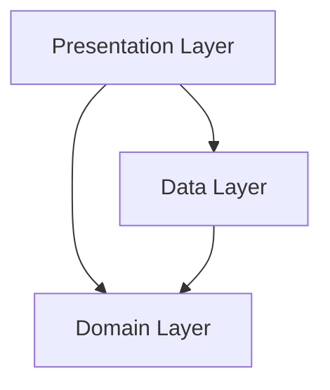

# System Architecture

The **Indoor Navigation System** follows **Clean Architecture** principles to ensure scalability, maintainability, and testability. The application is divided into distinct layers, ensuring separation of concerns and independence of frameworks.

## Architecture Overview



### 1. Domain Layer (Core Logic)
This is the innermost layer and contains the business logic of the application. It is completely independent of Flutter, Firebase, or any other external framework.

- **Entities**: Plain Dart objects representing core data (e.g., `Building`, `Room`, `Route`).
- **Use Cases**: Encapsulate specific business rules (e.g., `FindShortestPath`, `AddBuilding`, `GetAccessibleRoute`).
- **Repositories (Interfaces)**: Abstract definitions of how data should be accessed.

### 2. Data Layer (Data Management)
This layer is responsible for data retrieval and storage. It implements the repository interfaces defined in the domain layer.

- **Repositories (Implementations)**: Concrete classes that fetch data from sources.
- **Data Sources**:
  - **Remote**: Firebase Firestore, Firebase Auth.
  - **Local**: Shared Preferences, SQLite (future).
- **Models**: Data Transfer Objects (DTOs) that bridge the gap between API responses/Database records and Domain Entities.

### 3. Presentation Layer (UI)
This layer handles the user interface and state management.

- **Widgets**: Flutter UI components (`TripPlannerWidget`, `AdminDashboard`).
- **State Management**: Riverpod providers that manage UI state and interact with Use Cases.
- **Controllers**: Logic for handling user input and view updates.

## Core Modules

### Pathfinding Service
The heart of the navigation system is the `PathfindingService`, which implements the A* (A-Star) algorithm.

- **Algorithm**: A* with Euclidean distance heuristic.
- **Graph Structure**: 
  - Nodes: Rooms, Connectors (Stairs, Elevators).
  - Edges: Corridors with weights representing distance.
- **Optimization**: Supports multi-floor routing by connecting floor graphs via vertical connectors.

### Admin Map Management
Handles the creation and maintenance of the digital map.

- **Hierarchy**: Organization -> Building -> Floor -> Room.
- **Connectivity**: Automatically updates the navigation graph when map data is modified.

### Accessibility Service
Ensures the application is usable by everyone, managing inclusive routing and UI adaptations.

- **Routing**: Filters graph for wheelchair-accessible paths (avoiding stairs).
- **Metadata**: Manages accessibility tags for rooms and elevators.
- **UI Adaptation**: Provides high-contrast and screen-reader friendly elements.

## Data Flow

1. **User Action**: User searches for a room.
2. **Presentation**: Controller calls `FindRoomUseCase`.
3. **Domain**: Use Case requests data from `RoomRepository`.
4. **Data**: Repository fetches data from Firestore (or cache).
5. **Response**: Data flows back up to update the UI state.

## Tech Stack Decisions

- **Flutter**: For cross-platform native performance.
- **Riverpod**: For robust, testable, and compile-safe dependencies injection and state management.
- **Firebase Firestore**: For its flexible NoSQL structure suitable for hierarchical map data.
- **fpdart**: To handle errors and side effects using functional programming patterns (`Either<Failure, Success>`).

## Directory Structure

```
lib/
├── core/                   # Shared kernel
│   ├── errors/            # Failure classes
│   ├── usecases/          # Base use case
│   └── services/          # Core services (Pathfinding, Accessibility)
├── features/
│   ├── admin_map/         # Feature module
│   │   ├── data/
│   │   ├── domain/
│   │   └── presentation/
│   ├── navigation/        # Feature module
│   └── auth/              # Feature module
└── main.dart
```
