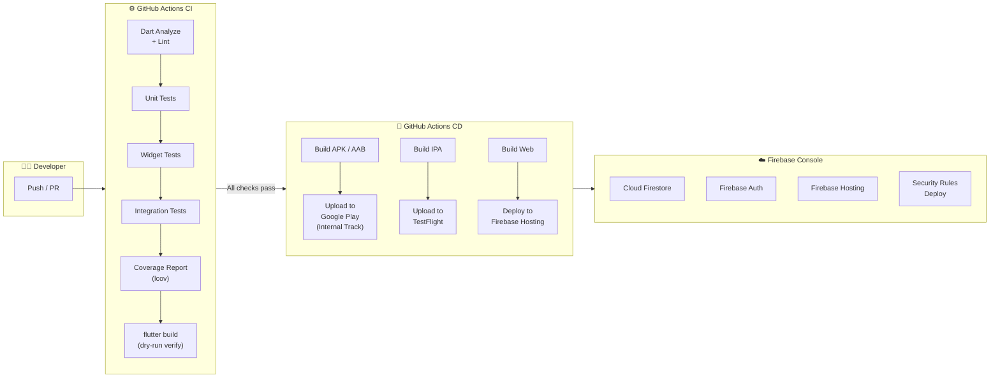
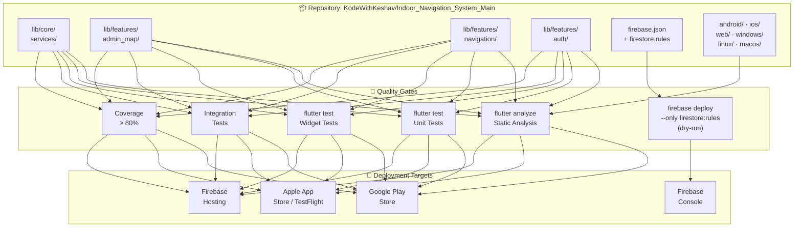
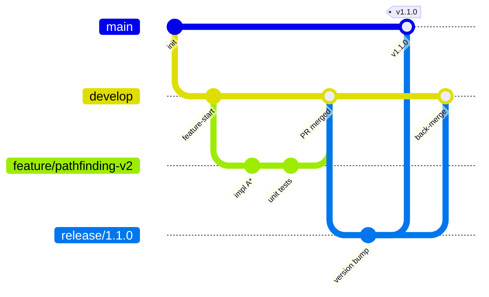
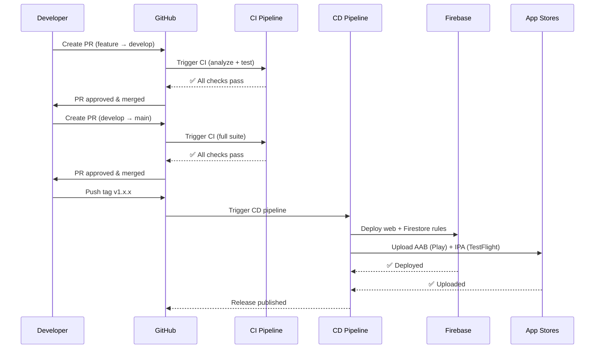

# DevOps Strategy — Indoor Navigation System

---

## 1. Overview

This document defines the end-to-end DevOps strategy for the **Indoor Navigation System** — a cross-platform Flutter application backed by Firebase services. It covers the source repository layout, deployment targets per component, quality gates (tests/checks) to pass before each deployment, and the recommended toolchain.

---

## 2. CI/CD Pipeline Diagram

### Component-Level Pipeline View

---

## 3. Component Inventory

### 3.1 Core Pathfinding Engine

| Attribute | Detail |
|-----------|--------|
| **Source Location** | `lib/core/services/pathfinding_service.dart`, `graph_service.dart`, `navigation_instruction_service.dart` |
| **Repository** | [`KodeWithKeshav/Indoor_Navigation_System_Main`](https://github.com/KodeWithKeshav/Indoor_Navigation_System_Main) |
| **Deployed As** | Compiled into the Flutter app binary (on-device computation) |
| **Deployment Target** | Android (APK/AAB), iOS (IPA), Web, Desktop |

**Pre-Deployment Checks:**

| # | Check | Tool / Command |
|---|-------|----------------|
| 1 | Static analysis | `flutter analyze` |
| 2 | Unit tests — A* pathfinding correctness | `flutter test test/unit/core/services/` |
| 3 | Unit tests — graph construction | `flutter test test/unit/core/services/` |
| 4 | Integration test — end-to-end route calculation | `flutter test test/pathfinding_accessibility_test.dart` |
| 5 | Code coverage ≥ 80% | `flutter test --coverage` + `lcov` |

---

### 3.2 Admin Map Management Module

| Attribute | Detail |
|-----------|--------|
| **Source Location** | `lib/features/admin_map/` (data / domain / presentation layers) |
| **Repository** | [`KodeWithKeshav/Indoor_Navigation_System_Main`](https://github.com/KodeWithKeshav/Indoor_Navigation_System_Main) |
| **Deployed As** | Part of the Flutter app binary |
| **Deployment Target** | Android, iOS, Web, Desktop |
| **Backend Dependency** | Firebase Cloud Firestore (CRUD operations) |

**Pre-Deployment Checks:**

| # | Check | Tool / Command |
|---|-------|----------------|
| 1 | Static analysis | `flutter analyze` |
| 2 | Unit tests — repository & use-case layer | `flutter test test/unit/features/admin_map/` |
| 3 | Widget tests — admin dashboard screens | `flutter test test/widget/organization_list_screen_test.dart` |
| 4 | Integration test — Firestore read/write with mocks | `flutter test test/indoor_map_data_test.dart` |
| 5 | Firestore security rules validation | `firebase emulators:exec --only firestore "npm test"` |

---

### 3.3 User Navigation Module

| Attribute | Detail |
|-----------|--------|
| **Source Location** | `lib/features/navigation/` (domain / presentation layers) |
| **Repository** | [`KodeWithKeshav/Indoor_Navigation_System_Main`](https://github.com/KodeWithKeshav/Indoor_Navigation_System_Main) |
| **Deployed As** | Part of the Flutter app binary |
| **Deployment Target** | Android, iOS, Web, Desktop |

**Pre-Deployment Checks:**

| # | Check | Tool / Command |
|---|-------|----------------|
| 1 | Static analysis | `flutter analyze` |
| 2 | Unit tests — navigation domain logic | `flutter test test/unit/features/navigation/` |
| 3 | Widget tests — trip planner UI | `flutter test test/widget/` |
| 4 | Accessibility routing tests | `flutter test test/pathfinding_accessibility_test.dart` |
| 5 | Code coverage threshold | `flutter test --coverage` |

---

### 3.4 Authentication Module

| Attribute | Detail |
|-----------|--------|
| **Source Location** | `lib/features/auth/` (data / domain / presentation layers) |
| **Repository** | [`KodeWithKeshav/Indoor_Navigation_System_Main`](https://github.com/KodeWithKeshav/Indoor_Navigation_System_Main) |
| **Deployed As** | Part of the Flutter app binary |
| **Deployment Target** | Android, iOS, Web, Desktop |
| **Backend Dependency** | Firebase Authentication (Email/Password) |

**Pre-Deployment Checks:**

| # | Check | Tool / Command |
|---|-------|----------------|
| 1 | Static analysis | `flutter analyze` |
| 2 | Unit tests — auth repository and use cases | `flutter test test/unit/features/auth/` |
| 3 | Widget tests — login/signup screens | `flutter test test/widget/auth_screens_test.dart` |
| 4 | Mock-based Firebase Auth tests | Uses `firebase_auth_mocks` package |
| 5 | Role-based access control validation | Manual / integration test |

---

### 3.5 Firebase Backend Infrastructure

| Attribute | Detail |
|-----------|--------|
| **Source Location** | `firebase.json`, `firestore.rules`, `firestore.indexes.json` (project root) |
| **Repository** | [`KodeWithKeshav/Indoor_Navigation_System_Main`](https://github.com/KodeWithKeshav/Indoor_Navigation_System_Main) |
| **Deployed To** | Firebase Console (Google Cloud) |
| **Services** | Cloud Firestore, Firebase Auth, Firebase Hosting |

**Pre-Deployment Checks:**

| # | Check | Tool / Command |
|---|-------|----------------|
| 1 | Security rules syntax validation | `firebase deploy --only firestore:rules --dry-run` |
| 2 | Rules unit tests | Firebase Emulator Suite + `@firebase/rules-unit-testing` |
| 3 | Index configuration review | `firebase firestore:indexes` diff |
| 4 | Hosting preview deploy | `firebase hosting:channel:deploy preview` |

---

### 3.6 Flutter App (Platform Shells)

| Attribute | Detail |
|-----------|--------|
| **Source Location** | `android/`, `ios/`, `web/`, `windows/`, `linux/`, `macos/` |
| **Repository** | [`KodeWithKeshav/Indoor_Navigation_System_Main`](https://github.com/KodeWithKeshav/Indoor_Navigation_System_Main) |
| **Deployment Targets** | See table below |

| Platform | Build Command | Artifact | Distribution Channel |
|----------|--------------|----------|---------------------|
| Android  | `flutter build appbundle` | `app-release.aab` | Google Play Console (Internal → Beta → Production) |
| iOS      | `flutter build ipa` | `Runner.xcarchive` | TestFlight → App Store |
| Web      | `flutter build web` | `build/web/` | Firebase Hosting |
| Windows  | `flutter build windows` | `build/windows/runner/Release/` | Direct distribution / Microsoft Store |
| Linux    | `flutter build linux` | `build/linux/x64/release/bundle/` | Snap Store / Direct |
| macOS    | `flutter build macos` | `.app` bundle | Direct distribution / Mac App Store |

**Pre-Deployment Checks:**

| # | Check | Tool / Command |
|---|-------|----------------|
| 1 | Full test suite passes | `flutter test` |
| 2 | Static analysis clean | `flutter analyze` |
| 3 | Build succeeds without errors | `flutter build <platform> --release` |
| 4 | App size regression check | Compare artifact size against baseline |
| 5 | Platform-specific signing | Verified keystore (Android) / provisioning profile (iOS) |

---

## 4. Environment Strategy

| Environment | Purpose | Firebase Project | Branch |
|-------------|---------|-----------------|--------|
| **Development** | Local testing, feature work | `indoor-nav-dev` | `feature/*`, `fix/*` |
| **Staging** | QA, integration testing, pre-release | `indoor-nav-staging` | `develop` |
| **Production** | Live users | `indoor-nav-prod` | `main` |

### Branch Strategy (Git Flow)

---

## 5. Tools, Platforms & Libraries

### 5.1 CI/CD Platform

| Tool | Purpose | Why |
|------|---------|-----|
| **GitHub Actions** | CI/CD orchestration | Native integration with GitHub repo; free tier for open-source; supports Flutter via community actions |
| **`subosito/flutter-action`** | Flutter setup in CI | Most popular and maintained Flutter GitHub Action |

### 5.2 Testing Tools

| Tool | Purpose | Usage |
|------|---------|-------|
| **`flutter test`** | Unit & widget tests | Core test runner for Dart/Flutter |
| **`mockito`** | Mocking framework | Generate mock classes for unit tests |
| **`mocktail`** | Lightweight mocking | No code-gen mocking alternative |
| **`fake_cloud_firestore`** | Firestore testing | In-memory Firestore for offline tests |
| **`firebase_auth_mocks`** | Auth testing | Mock Firebase Auth in unit tests |
| **`lcov`** | Coverage reporting | Generate HTML coverage reports |
| **`flutter analyze`** | Static analysis | Dart linter + `flutter_lints` rule set |
| **Firebase Emulator Suite** | Backend testing | Local emulators for Firestore, Auth, Hosting |

### 5.3 Build & Deployment Tools

| Tool | Purpose | Usage |
|------|---------|-------|
| **`flutter build`** | Build artifacts | APK, AAB, IPA, Web, Desktop builds |
| **Firebase CLI** | Backend deployment | Deploy Firestore rules, indexes, hosting |
| **Fastlane** (recommended) | Mobile release automation | Automate signing, building, and uploading to stores |
| **`firebase deploy`** | Web + rules deployment | Deploy web app to Firebase Hosting |
| **FlutterFire CLI** | Firebase config | Generate platform-specific Firebase configs |

### 5.4 Monitoring & Observability

| Tool | Purpose | Usage |
|------|---------|-------|
| **Firebase Crashlytics** | Crash reporting | Real-time crash monitoring in production |
| **Firebase Analytics** | Usage analytics | Track user navigation patterns and feature usage |
| **Firebase Performance** | Performance monitoring | Monitor app startup time, network latency |
| **GitHub Actions Dashboard** | CI/CD monitoring | Build status, test results, deployment history |

### 5.5 Security & Quality

| Tool | Purpose | Usage |
|------|---------|-------|
| **Dependabot** | Dependency updates | Auto-PRs for outdated/vulnerable packages |
| **GitHub Branch Protection** | Code review enforcement | Require PR reviews + passing CI before merge |
| **`dart pub outdated`** | Dependency health | Check for outdated packages |
| **Firestore Security Rules** | Data security | Role-based read/write access control |

---

## 6. Pre-Deployment Checklist (Summary)

| Gate | Applies To | Required For Merge | Required For Release |
|------|-----------|-------------------|---------------------|
| `flutter analyze` (zero issues) | All Dart code | ✅ | ✅ |
| Unit tests pass | Core, Features | ✅ | ✅ |
| Widget tests pass | Presentation layer | ✅ | ✅ |
| Integration tests pass | Cross-module flows | ❌ | ✅ |
| Coverage ≥ 80% | All testable code | ✅ | ✅ |
| Build succeeds | Platform artifacts | ❌ | ✅ |
| Security rules validated | Firestore rules | ✅ | ✅ |
| PR review approved (≥ 1) | All changes | ✅ | ✅ |
| No `pub outdated` critical | Dependencies | ❌ | ✅ |
| App size baseline check | Platform builds | ❌ | ✅ |

---

## 7. Release Process

---

## 8. Rollback Strategy

| Scenario | Action |
|----------|--------|
| **Web deployment fails** | `firebase hosting:rollback --project indoor-nav-prod` |
| **Bad Firestore rules** | Revert to previous rules via Firebase Console or re-deploy from last known-good commit |
| **Mobile app crash** | Halt staged rollout in Play Console / TestFlight; push hotfix from `main` |
| **Code regression** | `git revert` the bad merge → push → CI/CD auto-deploys fix |

---

## 9. Secrets Management

| Secret | Stored In | Used By |
|--------|-----------|---------|
| `FIREBASE_SERVICE_ACCOUNT` | GitHub Secrets | Firebase Hosting deploy |
| `FIREBASE_TOKEN` | GitHub Secrets | Firebase CLI commands |
| `PLAY_SERVICE_ACCOUNT` | GitHub Secrets | Google Play upload |
| `KEYSTORE_BASE64` | GitHub Secrets | Android app signing |
| `KEYSTORE_PASSWORD` | GitHub Secrets | Android app signing |
| `MATCH_PASSWORD` | GitHub Secrets | iOS code signing (Fastlane Match) |
| Firebase config files | `.gitignore`'d / CI env | App build |

---

*Document Version: 1.0.0 — February 2026*
*Maintained by the Indoor Navigation System DevOps Team*
